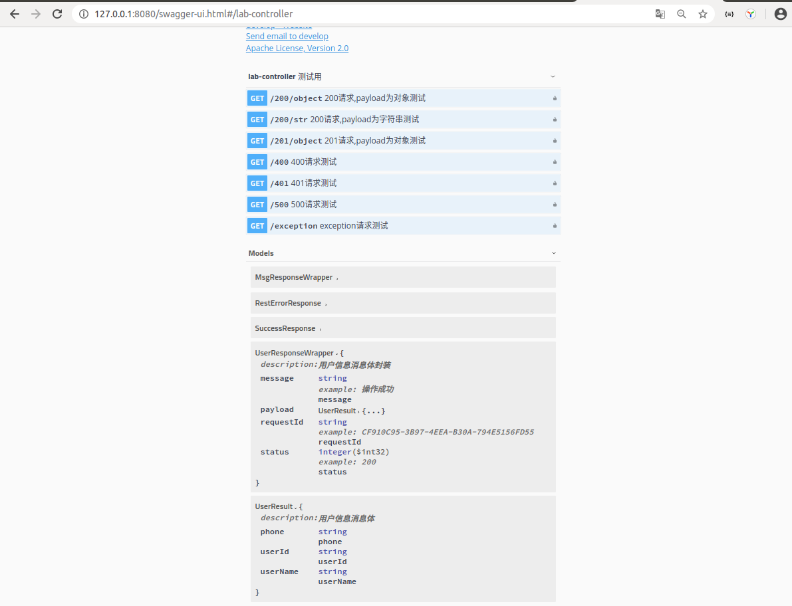
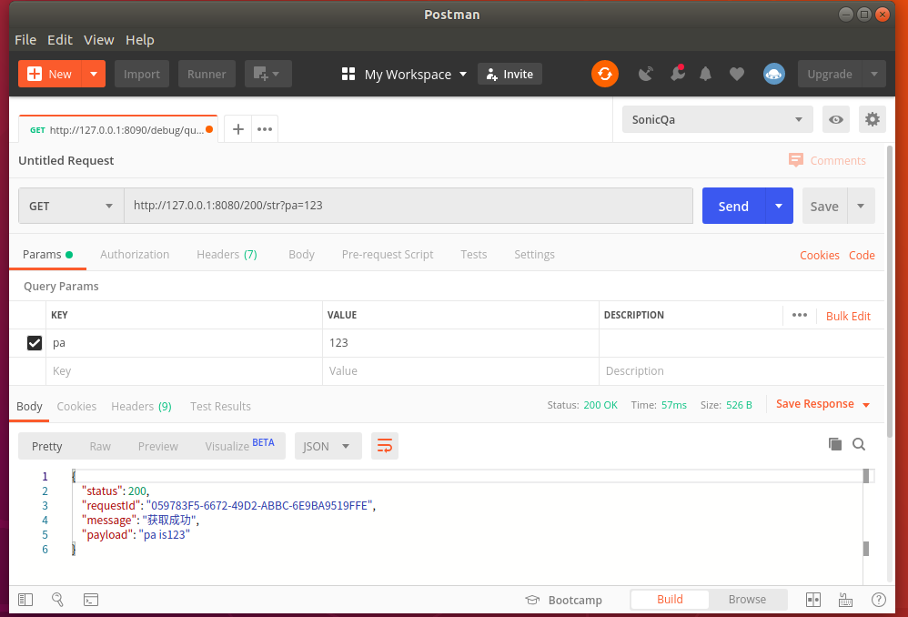
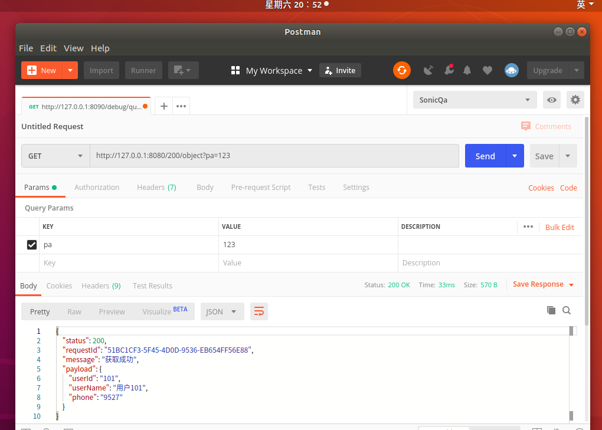
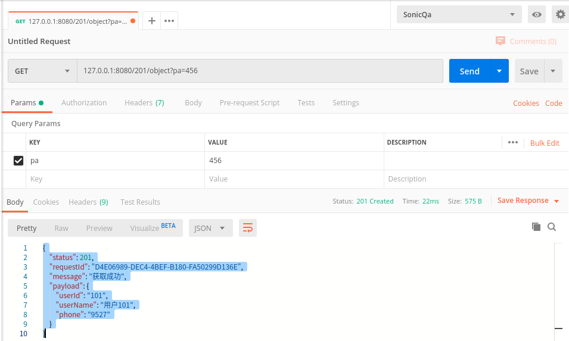
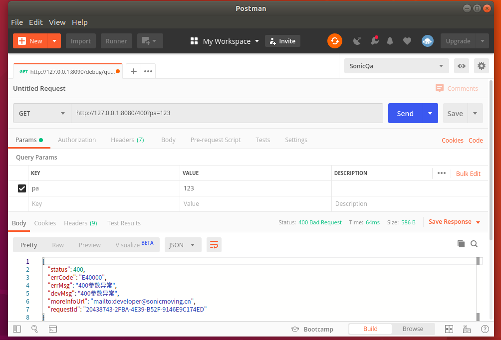
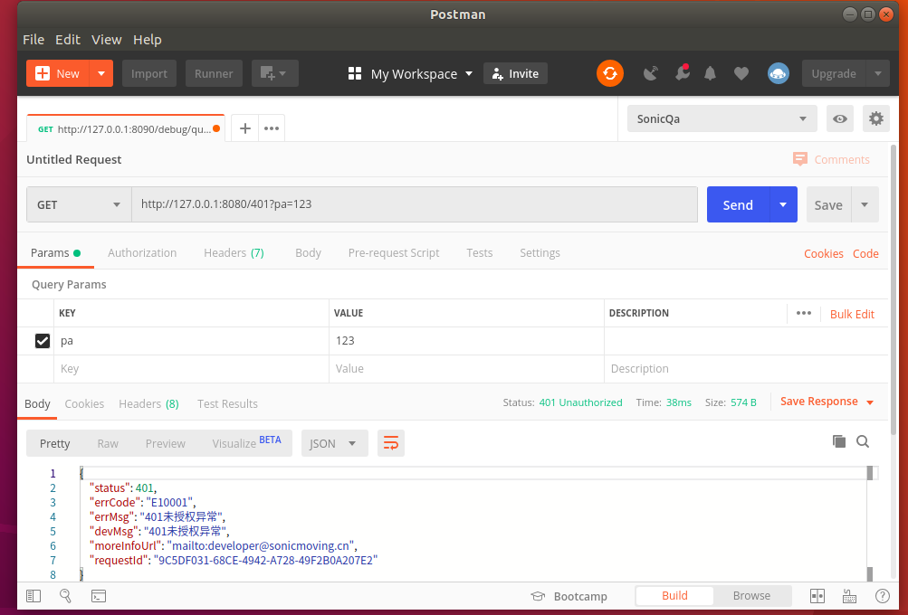
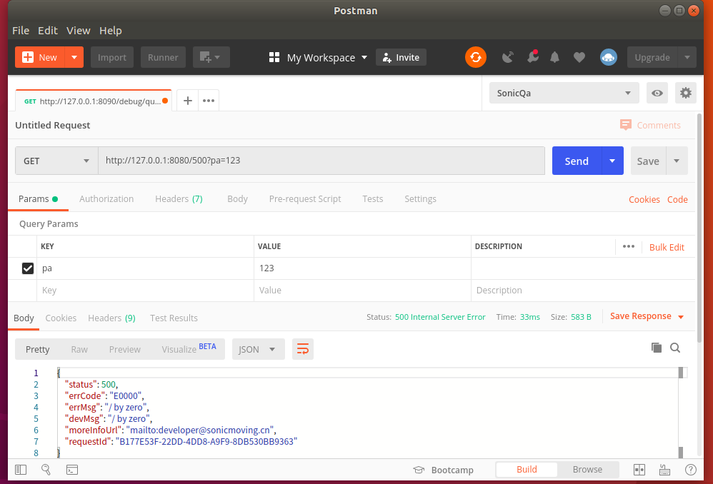
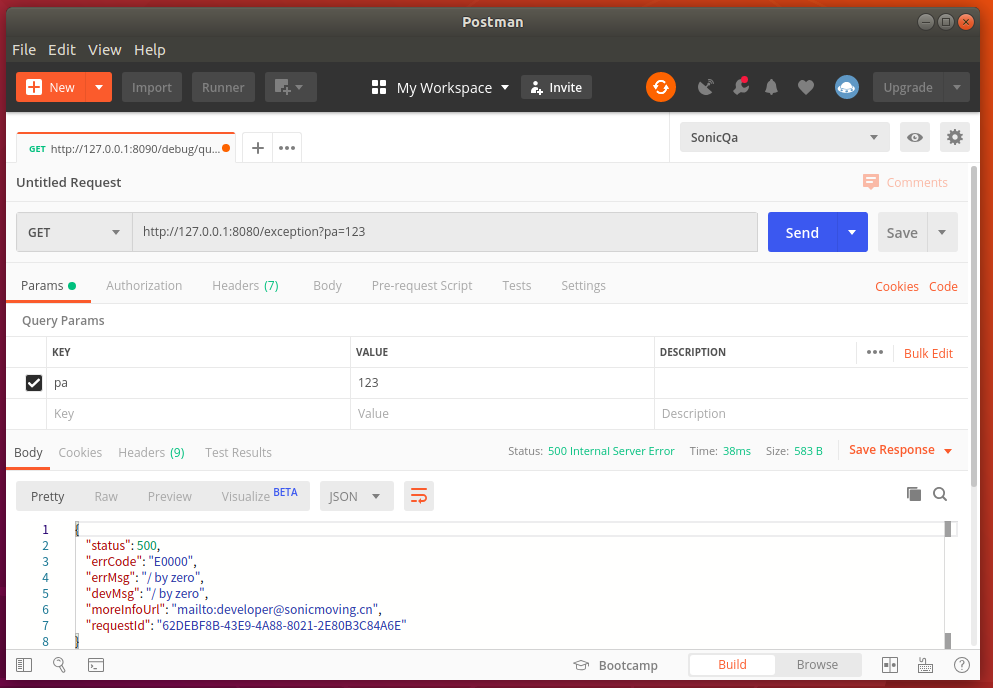

## swagger显示的api接口信息
  

## http状态200,payload为字符串
    {
        "status": 200,
        "requestId": "6584B6A8-9255-4CC5-864C-CF479B453B78",
        "message": "获取成功",
        "payload": "pa is123"
    }
  

## http状态200,payload为对象
    {
        "status": 200,
        "requestId": "ED802D63-1370-4EC6-BAF8-39D96FB6E845",
        "message": "获取成功",
        "payload": {
            "userId": "101",
            "userName": "用户101",
            "phone": "9527"
        }
    }
  

## http状态201,payload为对象
    {
        "status": 201,
        "requestId": "D4E06989-DEC4-4BEF-B180-FA50299D136E",
        "message": "获取成功",
        "payload": {
            "userId": "101",
            "userName": "用户101",
            "phone": "9527"
        }
    }
  

## http状态400,参数有误
    {
        "status": 400,
        "errCode": "E40000",
        "errMsg": "400参数异常",
        "devMsg": "400参数异常",
        "moreInfoUrl": "mailto:developer@sonicmoving.cn",
        "requestId": "EFF5E27A-3512-49E8-8261-4F85ED9119F9"
    }
  

## http状态401,账号验证不通过
    {
        "status": 401,
        "errCode": "E10001",
        "errMsg": "401未授权异常",
        "devMsg": "401未授权异常",
        "moreInfoUrl": "mailto:developer@sonicmoving.cn",
        "requestId": "87B13846-ED70-4D65-9F4C-F43E0285FE5E"
    }
   

## http状态500,服务端内部错误
    {
        "status": 500,
        "errCode": "E0000",
        "errMsg": "/ by zero",
        "devMsg": "/ by zero",
        "moreInfoUrl": "mailto:developer@sonicmoving.cn",
        "requestId": "C6068BC7-901B-402A-80CC-A9DFF4D66CFC"
    }
         
  
## http状态500,controller抛出Exception
      {
        "status": 500,
        "errCode": "E0000",
        "errMsg": "/ by zero",
        "devMsg": "/ by zero",
        "moreInfoUrl": "mailto:developer@sonicmoving.cn",
        "requestId": "5739ACE1-7120-4A06-BE7F-B6DFF27C70B2"
    }
     
